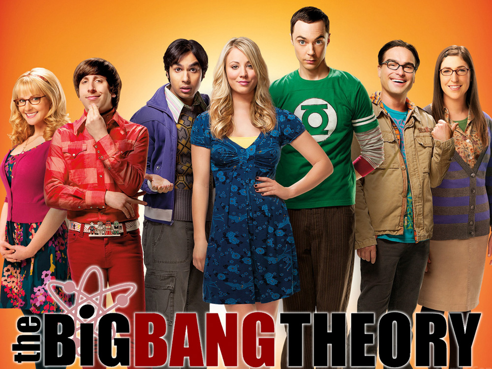
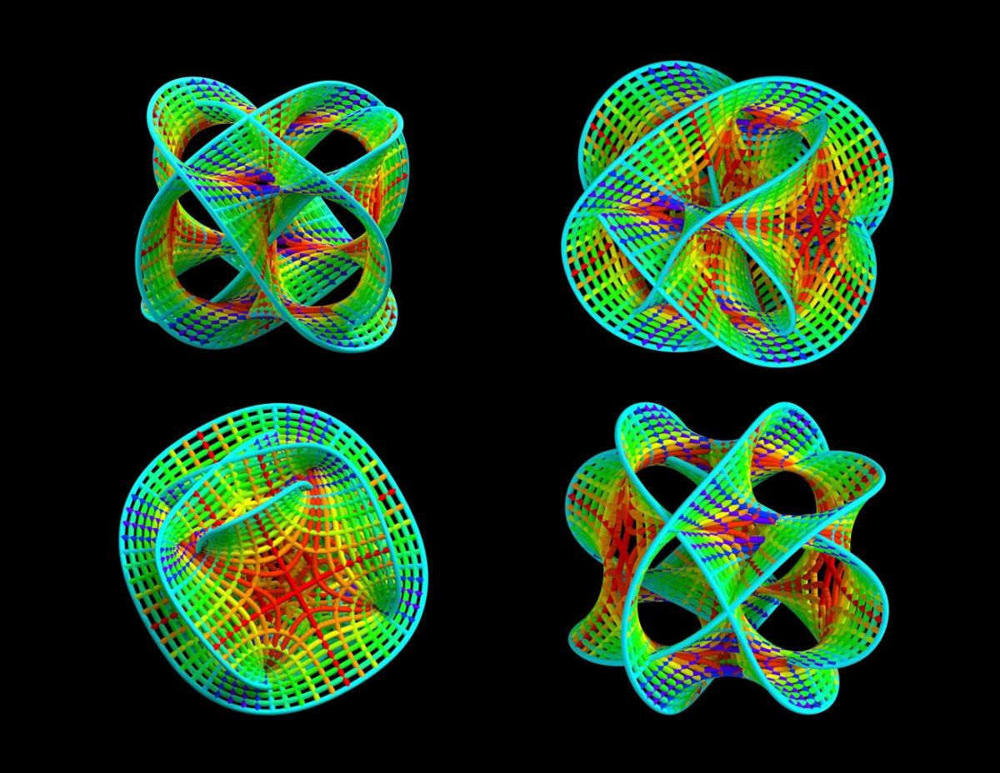
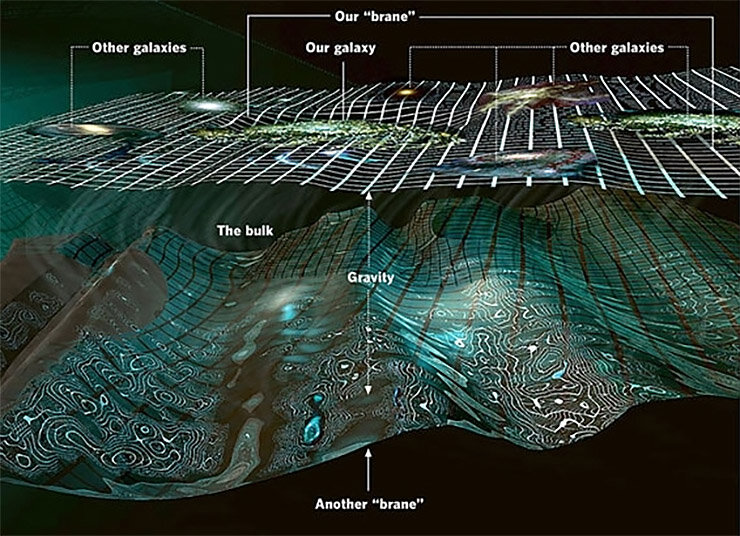
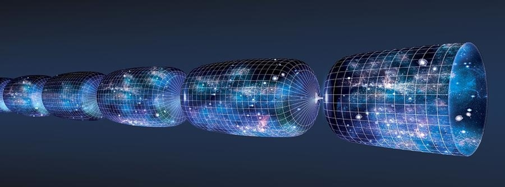
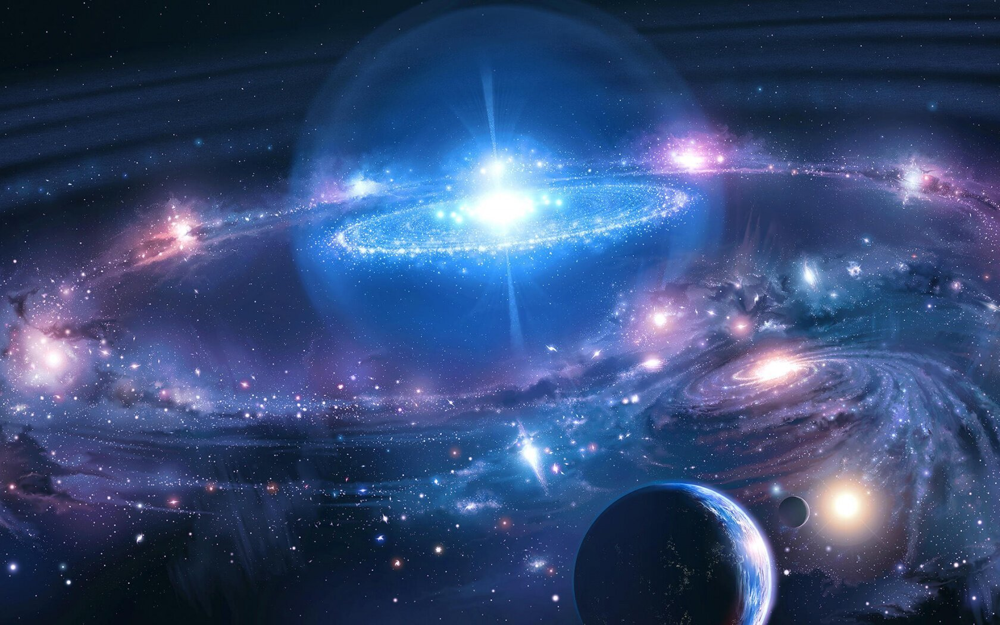

# *** <ins> Происхождение Вселенной - Начало*** 

Происхождение Вселенной остается одной из главных загадок науки. С начала наблюдений за звездным небом человечество пыталось понять, как возникло все, что его окружает, и что там за пределами нашего мира. С развитием технологий ему покорились многие природные явления и даже просторы космоса, но никто так до сих пор и не установил, как зародилась Вселенная. Однако, астрономы выдвинули множество теорий на этот счет, некоторые из них вполне логичны и правдоподобны.

## *** Современное представление о возникновении Вселенной*** 

- Теория Большого взрыва
- Инфляционная теория
- Теория струн
- Теория бран
- Теория стационарной Вселенной

## *** <ins> Теория большого взрыва***

Основной теорией возникновения Вселенной в ее нынешнем состоянии является ***Теория большого взрыва***. Впервые этот термин был применен британским астрономом [Ф. Хойлом](https://ru.wikipedia.org/wiki/Хойл,_Фред) в 1949 году. При этом сам ученый считал данное предположение о происхождении и эволюции Вселенной ошибочным.

Сами же идеи о расширении Вселенной и ее развитии в результате взрывного процесса возникли в начале 20 века. Способствовал этому [Альберт Эйнштейн](https://ru.wikipedia.org/wiki/Эйнштейн,_Альберт), опубликовавший свою [теорию относительности](https://ru.wikipedia.org/wiki/Общая_теория_относительности). Нестационарное решение его гравитационного уравнения натолкнуло советского физика [Фридмана](https://ru.wikipedia.org/wiki/Фридман,_Александр_Александрович) на гипотезу о том, что Универсум – постоянно расширяющийся объект. По его версии, вначале она представляла собой очень плотное, однородное вещество. Оно в результате большого взрыва начало распространяться, образуя привычные нам элементы космоса – галактики, туманности, звезды, планеты и другие тела.

Теория происхождения Вселенной по Фридману неоднократно подвергалась дополнениям и улучшениям. В 1948 году астрофизик [Георгий Гамов](https://ru.wikipedia.org/wiki/Гамов,_Георгий_Антонович) опубликовал работу, в которой описывал первичное вещество до Большого взрыва не только как очень плотное, но и как очень горячее. В нем постоянно происходили реакции термоядерного синтеза, в результате которых образовались ядра легких химических элементов. Выделяемое при этом электромагнитное излучение сохранилось до сих пор, но в остывающем виде. Теория была подтверждена почти через 20 лет после того, как ученым удалось открыть и измерить температуру космического фона. Изучение реликтового излучения также помогла установить возраст мироздания и распределение в нем вещества.

### *** Хронология событий в теории Большого взрыва*** 

!!!Note Теория эволюции Вселенной подразумевает, что до Большого взрыва все мироздание находилось в принципиально другом состоянии. А после – проходило стадии развития, благодаря которым заполнилось частицами, химическими элементами и другими структурами. Они же послужили строительным материалом для всех космических тел и объектов. Каждый эпоха развития имеет свою продолжительность от незначительных долей секунды до миллиардов лет. Попробуем изложить теорию происхождения Вселенной кратко и простым языком.

* #### *** Эпоха сингулярности*** 

Большому взрыву и происхождению Вселенной в современном ее виде предшествовала стадия космологической сингулярности. Это состояние Универсума, при котором вещество имеет почти бесконечные значения плотности и температуры, а само оно стремится к нулю.

Космологическая сингулярность – один из самых трудных вопросов современной науки. Невозможно точно установить, что именно было до Большого взрыва. Но бесконечная плотность раннего вселенского вещества не может сопровождаться его бесконечной температурой. Следовательно, сингулярная Вселенная противоречит современным законам физики.

По некоторым предположениям, эпохи сингулярности вообще не существовало. Еще по предположению группы ученых, в число которых входит [С.Хокинг](https://ru.wikipedia.org/wiki/Хокинг,_Стивен), все сущее могло возникнуть из абсолютного вакуума («ничего») из-за колебаний системы. По другой теории, Большой взрыв привел лишь к образованию Метагалактики, как «пузырька» в плотном веществе Универсума. Есть также гипотеза о том, что вселенные образуются из-за разрывов сингулярности в пределах черных дыр. Доподлинно же установить, что было до Большого взрыва, не представляется возможным.

* #### *** Планковская эпоха*** 

Итак, в первичном мироздании произошел катастрофический процесс, в результате которого вещество начало стремительно расширяться и охлаждаться. При чем для формирования всех структур космического пространства взрыв должен был произойти повсюду.  Это и является точкой отчета возникновения мироздания в его нынешнем виде.

В период от нуля до 10$^{-43}$ секунд вещество Универсума имело физические параметры (температура, энергия, плотность) соответствующие постоянным [Планка](https://ru.wikipedia.org/wiki/Планк,_Макс). В таких условиях планковской эпохи произошло рождение частиц.

* #### *** Эпоха великого объединения*** 

В период с 10$^{-43}$ по 10$^{-35}$ секунд после Большого взрыва в относительно устойчивой системе возникли силы гравитации. Они впоследствии способствовали возникновению звезд и планет. Первичная материя перестала быть однородно плотной. Но электромагнитное и ядерное взаимодействия в ней  были еще объединены, поэтому любые физико-химические параметры для этого вещества не имеют смысла.

* #### ***Эпоха инфляции***

При переходе в эту стадию эволюции Вселенная начала ускоренно расширяться. Это позволило перераспределиться высокоплотному изотропному первичному веществу. Эпоха заняла промежуток времени с 10$^{-35}$ по 10$^{-32}$ секунды от взрывного процесса.

* #### ***Электрослабая эпоха***

К этому моменту сильное ядерное взаимодействие, как и гравитация, отделено от первичной материи. Период с 10$^{-32}$ по 10$^{-12}$ секунд – момент рождения таких элементарных частиц, как хиггсовский бозон и W-, Z-частицы. Симметрия до вселенского вещества окончательно разрушена.

* #### ***Кварковая эпоха***

С 10$^{-12}$ по 10$^{-6}$ секунд все четыре фундаментальные взаимодействия начинают существовать отдельно. Все вещество Универсума представляет собой «кварковый суп» из безмассовых и бесструктурных фундаментальных частиц.

* #### ***Андронная эпоха***

Из фундаментальных частиц начали образовываться андроны – частицы с сильным ядерным взаимодействием. Именно из них образуются нуклоны, формирующее атомные ядра, протоны и нейтроны. Весь процесс андронизации занял порядка ста секунд после Большого взрыва.

* #### ***Лептонная эпоха***

Первые три минуты существования Универсума происходит формирование лептонов, в том числе и их подвида – нейтрино. Это еще одни фундаментальные структуры вселенского вещества, из которых в дальнейшем было построено все в мироздании.

* #### ***Протонная эпоха***

Более 300 тысяч лет ушло на первичный процесс нуклеосинтеза легких химических элементов  и перераспределения вещества Универсума. Оно стало доминировать над излучением, что замедлило расширение космического пространства. Конец данной стадии ознаменовался возможностью передвижения тепловых фотонов.

* #### ***Темные века***

Ни одной привычной нам космической структуры в первые 500 млн. лет после возникновения Вселенной не существовало. Она была заполнена водородно-гелиевой массой и реликтовым тепловым излучением, распространяющимся по всему ее пространству.

* #### ***Реионизация***

Постепенно облака водорода и гелия под воздействием гравитации начали сжиматься, в них стали зарождаться процессы термоядерного синтеза. Появились первые звезды. Они стали собираться в скопления, называемые галактиками. В центре формирующихся галактик возникал источник мощнейшего излучения и гравитационного притяжения – квазар. Этот процесс занял более 300 млн. лет.

* #### ***Эра вещества***

Молодые звезды формируют вокруг себя протопланетные диски, из которых впоследствии образовываются целые планетарные системы. В эту эру 4,6 млрд. лет назад возникла и ***<mark> Солнечная система*** со всеми окружающими ее планетами.  Вся же история Вселенной продолжается более 13,7 млрд.лет.

## *** <ins> Инфляционная модель Вселенной*** 

Космологическая модель, предполагающая, что на самом раннем этапе эволюции Вселенной, когда её возраст составлял от 10$^{–43}$ с до 10$^{–37}$ с, Вселенная претерпела колоссальное расширение, которое привело к экспоненциальному росту всех пространственных масштабов. Термин «инфляция» в космологии обозначает быстрый рост масштабов, при котором скорость роста пропорциональна значению самого масштаба. Этот термин очень точно описывает характер расширения ранней Вселенной.

Расширение Вселенной было твёрдо установлено уже в середине 20 века, однако причины, приведшие к нему, оставались неизвестными. Стандартная космологическая модель Фридмана не могла ответить на вопрос о физических причинах расширения Вселенной. Найти ответ удалось лишь в конце 20 века, применив к описанию ранней Вселенной новейшие результаты физики элементарных частиц.

Ещё до возникновения термина «Инфляционная модель Вселенной» основные свойства этой модели были исследованы физиками [В. А. Рубаковым](https://ru.wikipedia.org/wiki/Рубаков,_Валерий_Анатольевич) и [А. А. Старобинским](https://ru.wikipedia.org/wiki/Старобинский,_Алексей_Александрович) (кон. 1970-х гг.). Первая Инфляционная модель Вселенной была создана физиком [А. Д. Линде](https://ru.wikipedia.org/wiki/Линде,_Андрей_Дмитриевич). Большой вклад в исследование наблюдательных проявлений ранней Вселенной внесли физики и космологи А. Г. Дорошкевич, Я. Б. Зельдович, В. Н. Лукаш, М. В. Сажин, Д. П. Скулачёв, И. А. Струков и др.

Согласно Инфляционная модель Вселенной, вскоре после рождения Вселенной (т. н. Большого взрыва) наступила инфляционная стадия. Она характеризуется релятивистским отрицательным давлением, при котором меняются физические законы обычной теории гравитации: вещество становится не источником притяжения, а источником отталкивания. На этой стадии объём Вселенной увеличивается во много раз, в результате чего вся современная Вселенная оказывается в одной причинно связанной области, и уравниваются кинетическая энергия расширения Вселенной и её потенциальная энергия. Из-за действия сил отталкивания Вселенная «разгоняется» и приобретает большую кинетич. энергию, которая в дальнейшем проявляется в виде хаббловского расширения по инерции.

Имеющимся наблюдательным данным точнее всего соответствует теория хаотической, или вечной, инфляции, предложенная А. Д. Линде. Согласно этой теории, Вселенная заполнена особым видом материи (т. н. скалярным полем), обладающим предельно большой плотностью и релятивистским отрицательным давлением. В модели хаотической инфляции объём Вселенной постоянно растёт и выделяются причинно связанные домены, в которых инфляция заканчивается, поскольку состояние вещества с отрицательным давлением неустойчиво. При этом вся потенциальная энергия, запасённая в cкалярном поле, выделяется в виде элементарных частиц и их тепловой энергии – образуется горячая плазма. Так с окончанием эпохи инфляции рождается обычная материя.

В тех доменах, где инфляция закончилась, начинается эволюция Вселенной по законам, открытым А. А. Фридманом. Таким образом, согласно инфляционной модели, Вселенная разбивается на много причинно несвязанных областей, и каждую такую область можно рассматривать как отдельную «мини-вселенную». Совокупность всех «мини-вселенных» составляет «мультивселенную».

На стадии инфляции из квантовых флуктуаций скалярного поля рождаются возмущения плотности. Квантовые флуктуации, которые обычно проявляются только в микроскопич. масштабах, в экспоненциально расширяющейся Вселенной быстро увеличивают свою длину и амплитуду и становятся космологически значимыми. Поэтому можно сказать, что скопления галактик и сами галактики являются макроскопич. проявлениями квантовых флуктуаций. И. м. В. предсказывает вид спектра этих флуктуаций, подтверждённый наблюдениями крупномасштабной структуры Вселенной и анизотропии реликтового излучения.

## *** <ins> Теория струн*** 

 

Хотя теория струн имеет репутацию сложной теории, её основная идея очень простая. Стандартная точка зрения, до теории струн, состояла в том, что фундаментальные составляющие являются точечными частицами — точками без внутренней структуры, — которые описываются уравнениями квантовой теории поля. Теория струн бросает вызов такому представлению, утверждая, что частицы не являются точечными. Вместо этого, предлагается рассматривать их как крошечные, струноподобные вибрирующие нити.

При более детальном рассмотрении, говорит теория, вы увидите, что струны в частицах разного типа неразличимы, но вибрируют они по-разному. Электрон менее массивен чем кварк, и согласно теории струн, это означает, что струна электрона вибрирует менее энергично, чем струна кварка. Различные свойства частиц объясняются разным вибрационным поведением нитей в теории струн, подобно тому как разные вибрации гитарных струн порождают звучание разных музыкальных нот.

По причине бесконечно малого размера струны, порядка планковской длины — 10$^{-33}$ сантиметра, даже самые точные современные эксперименты не могут подтвердить или опровергнуть протяжённую структуру струны. БАК, на котором частицы сталкиваются друг с другом при энергиях, превышающих в 10 триллионов раз энергию покоящегося протона, может добраться до расстояний примерно 10$^{-19}$ сантиметра; это миллионная от миллиардной доли толщины волоса, но всё же оно слишком велико, на много порядков больше планковских расстояний. Поэтому струны выглядят как точки, даже если их изучать на самых мощных в мире ускорителях частиц. Тем не менее, согласно теории струн, частицы являются струнами. В этом, в двух словах, и заключается теория струн.

## *** <ins> Теория бран*** 

M-теория (теория бран) — вариант теории струн, современная физическая теория, созданная с целью объединения фундаментальных взаимодействий. В качестве базового объекта используется так называемая «брана» (многомерная мембрана) — протяжённый двухмерный или с бо́льшим числом измерений (n-брана) объект.

В середине 1990-х [Эдвард Виттен](https://ru.wikipedia.org/wiki/Виттен,_Эдвард) и другие физики-теоретики обнаружили веские доказательства того, что различные суперструнные теории представляют собой различные предельные случаи неразработанной пока 11-мерной М-теории. Это открытие ознаменовало вторую суперструнную революцию.

Как правило, классическая (не квантовая) релятивистская динамика n-бран строится на основе принципа наименьшего действия для многообразия размерности n+1 (n пространственных измерений плюс временное), находящегося в пространстве высшей размерности. Координаты внешнего пространства-времени рассматриваются как поля, заданные на многообразии браны. При этом группа Лоренца становится группой внутренней симметрии этих полей.

## *** <ins> Теория стационарной Вселенной*** 

После открытия закона Хаббла большинство астрономов приняли теорию Большого взрыва — концепцию, согласно которой Вселенная образовалась в прошлом из некоей точки. Однако в 1940-е годы группа астрофизиков под руководством Фреда Хойла предложила альтернативную теорию.

Главная идея этой теории заключается в следующем: по мере того как галактики удаляются друг от друга при хаббловском расширении, в увеличивающемся пространстве между ними образуется новая материя. Вновь образованная материя со временем самоорганизуется в галактики, которые, в свою очередь, будут удаляться друг от друга, высвобождая пространство для образования новой материи. Таким образом, наблюдаемое расширение было согласовано с понятием «стационарной» Вселенной, сохраняющей свою общую плотность и не имеющей единственной точки образования (наличие которой предполагает теория Большого взрыва). Но при этом требовалось принять без доказательств новую концепцию процесса образования вещества.

Некоторые астрономы поддерживали теорию стационарной Вселенной вплоть до середины 1960-х годов. Основным достоинством этой теории была ее философская сторона. Утверждалось, что теория согласуется с принципом Коперника о том, что наш мир не уникален, и не выделяет какой-то момент времени как главный.

Вскоре начали появляться доводы против теории. Во-первых, в точных лабораторных экспериментах не удалось воспроизвести образование вещества. Во-вторых, что важнее, новые открытия в космологии — такие как космический микроволновый фон (см. Большой взрыв) — показали, что многие явления во Вселенной можно объяснить исходя из сценария Большого взрыва, но не из теории стационарной Вселенной. Например, когда мощные телескопы смогли заглянуть во Вселенную поглубже и таким образом проникнуть в ее прошлое, стало ясно, что все наиболее удаленные галактики представляют собой молодые, еще не сформировавшиеся системы. Это — как раз то, что и ожидалось от Вселенной, возникшей в результате Большого взрыва, но никак не согласовывалось с картиной стационарности. В конце концов большинство защитников теории стационарной Вселенной, сраженные этим контраргументом, просто сдались.

Однако до наших дней дошло одно наследие этой теории — сам термин «Большой взрыв». Изначально его предложил Хойл — чтобы посмеяться над своими оппонентами, и, наверное, он был очень удивлен, когда те с восторгом приняли этот термин.

